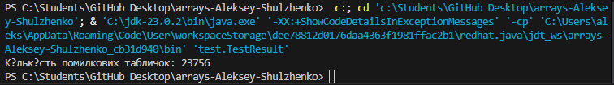

# На склаі є 50000 полиць. Для кожної полиці замовили табличку з номером, але коли таблички надрукували, виявилося що друкарський верстат через несправності не друкував цифру 2, тому всі таблички, в номерах яких містились "двійки" (00002, 20202 тощо) треба передрукувати. Визначте число таких помилкових табличок

## Exercise.java
````java
package domain;

public class Exercise {
    // Метод для підрахунку кількості помилкових табличок
    public static int countBadPlates(int max) {
        int count = 0;
        for (int i = 0; i < max; i++) {
            if (String.valueOf(i).contains("2")) {
                count++;
            }
        }
        return count;
    }
}
````

# TestResult.java
````java
package test;

import domain.Exercise;

public class TestResult {
    public static void main(String[] args) {
        int total = 50000;
        int badPlates = Exercise.countBadPlates(total);
        System.out.println("Кількість помилкових табличок: " + badPlates);
    }
}
````

# Результат 
